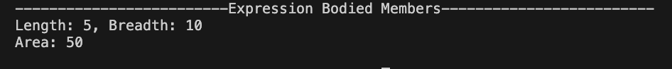
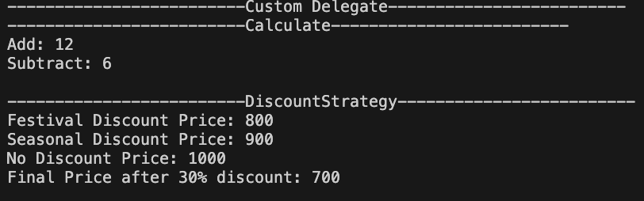
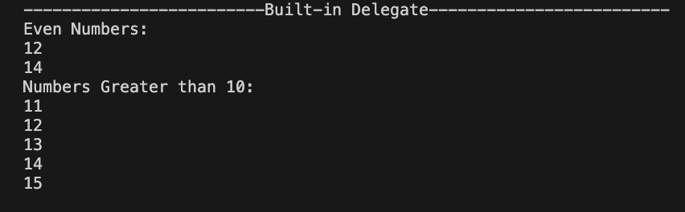
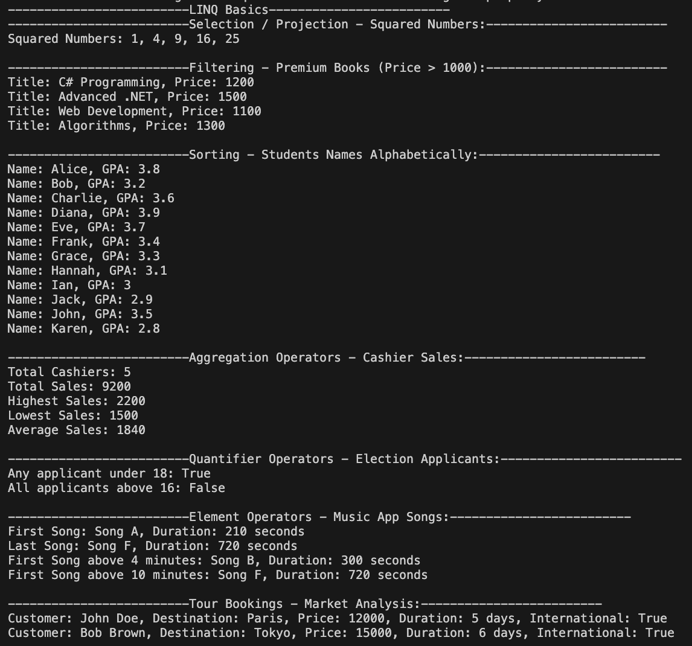

# Assignment

## Task 1: Expression Bodied Members

### 1. The class below calculates the area of a rectangle. Convert both properties and methods into expression-bodied members. Also add a method to calculate its perimeter

``` c#
// 1. The class below calculates the area of a rectangle. Convert both properties and methods into expression-bodied members. Also add a method to calculate its perimeter.

public class QuestionRectangle
{
    private double length;
    private double breadth;

    public double Length
    {
        get { return length; }
        set { length = value; }
    }
    public double Breadth
    {
        get { return breadth; }
        set { breadth = value; }
    }
    public double GetArea()
    {
        return length * breadth;
    }
    public string ShowDetails()
    {
        return $"Length: {length}, Breadth: {breadth}";
    }
}

// IN EXORESSION BODIES MEMBERS
public class Rectangle
{
    private double length;
    private double breadth;

    public double Length
    {
        get => length;
        set => length = value;
    }
    public double Breadth
    {
        get => breadth;
        set => breadth = value;
    }
    public double GetArea() => length * breadth;

    public string ShowDetails() => $"Length: {length}, Breadth: {breadth}";
}

class Program
{
    static void Main(string[] args)
    {
        System.Console.WriteLine("-------------------------Expression Bodied Members-------------------------");

        Rectangle rect = new Rectangle();
        rect.Length = 5;
        rect.Breadth = 10;
        System.Console.WriteLine(rect.ShowDetails());
        System.Console.WriteLine($"Area: {rect.GetArea()}");
        System.Console.WriteLine();
    }
}
```



## Task 2: Custom Delegate
### 1. Create a delegate named Calculate that accepts two integers and returns an integer.
- Write two methods: Add() and Subtract().
- Use the delegate to call both methods.


### 2. Define a delegate named DiscountStrategy that takes a price (double) and returns the discounted price.
- Create three discount methods:
- FestivalDiscount → 20% off
- SeasonalDiscount → 10% off
- NoDiscount → returns price as it is


#### 2.1 Create a method named CalculateFinalPrice(double originalPrice,    DiscountStrategy strategy) that:
- Accepts the original price
- Accepts a delegate as the discount strategy
- Returns the final payable amount


#### 2.2 In Program.cs , call CalculateFinalPrice method by passing original price and all discount strategy method one by one.
#### 2.3 Again, call CalculateFinalPrice method by passing an original value and a Lambda expression where 30% discount is granted.
``` c#
// 1. Create a delegate named Calculate that accepts two integers and returns an integer.
//      • Write two methods: Add() and Subtract().
//      • Use the delegate to call both methods.

public delegate int Calculate(int num1, int num2);
public static class Calculator
{
    public static int Add(int a, int b) => a + b;
    public static int Subtract(int a, int b) => a - b;
}

// 2. Define a delegate named DiscountStrategy that takes a price (double) and returns the discounted price.
//      • Create three discount methods:
//      • FestivalDiscount → 20% off
//      • SeasonalDiscount → 10% off
//      • NoDiscount → returns price as it is
public delegate double DiscountStrategy(double price);
public static class Discount
{
    public static double FestivalDiscount(double price) => price * 0.8;
    public static double SeasonalDiscount(double price) => price * 0.9;
    public static double NoDiscount(double price) => price;

// 2.1 Create a method named CalculateFinalPrice(double originalPrice, DiscountStrategy strategy) that:
//      • Accepts the original price
//      • Accepts a delegate as the discount strategy
//      • Returns the final payable amount

    public static double CalculateFinalPrice(double originalPrice, DiscountStrategy finalPayableAmount)
    {
        return finalPayableAmount(originalPrice);
    }
}


class Program{
    static void Main(string[] args)
    {   
        System.Console.WriteLine("-------------------------Custom Delegate-------------------------");
        System.Console.WriteLine("-------------------------Calculate-------------------------");
        Calculate calculate = Calculator.Add;
        int sum = calculate(5, 7);
        System.Console.WriteLine($"Add: {sum}");
        calculate = Calculator.Subtract;
        int difference = calculate(10, 4);
        System.Console.WriteLine($"Subtract: {difference}");
        System.Console.WriteLine();

        System.Console.WriteLine("-------------------------DiscountStrategy-------------------------");
        DiscountStrategy discountStrategy = Discount.FestivalDiscount;
        double festivalPrice = discountStrategy(1000);
        System.Console.WriteLine($"Festival Discount Price: {festivalPrice}");
        discountStrategy = Discount.SeasonalDiscount;
        double seasonalPrice = discountStrategy(1000);
        System.Console.WriteLine($"Seasonal Discount Price: {seasonalPrice}");
        discountStrategy = Discount.NoDiscount;
        double noDiscountPrice = discountStrategy(1000);
        System.Console.WriteLine($"No Discount Price: {noDiscountPrice}");
        double finalPrice = Discount.CalculateFinalPrice(1000, price => price * 0.7);
        System.Console.WriteLine($"Final Price after 30% discount: {finalPrice}");
        System.Console.WriteLine();
    }
}
```



## Task 3 : Built-in Delegate
### 1. Create a method:
- void ProcessNumbers(int[] numbers, Func<int, bool> condition)
### 2. Use it to print:
- Only even numbers
- Only numbers greater than 10\
    (Pass a Func delegate for the condition.)

```c#
// 1. Create a method:
//      • void ProcessNumbers(int[] numbers, Func<int, bool> condition)
// 2. Use it to print:
//      • Only even numbers
//      • Only numbers greater than 10
//      (Pass a Func delegate for the condition.)

public class BuiltInDelegate
{
    public static void ProcessNumbers(int[] numbers, System.Func<int, bool> condition)
    {
        foreach (var num in numbers)
        {
            if (condition(num))
            {
                System.Console.WriteLine(num);
            }
        }
    }
}

class Program{
    static void Main(string[] args){
         System.Console.WriteLine("-------------------------Built-in Delegate-------------------------");
        int[] numbers = { 1, 2, 3, 4, 5, 11, 12, 13, 14, 15 };
        System.Console.WriteLine("Even Numbers:");
        BuiltInDelegate.ProcessNumbers(numbers, number => (number % 2 == 0) && (number > 10));
        System.Console.WriteLine("Numbers Greater than 10:");
        BuiltInDelegate.ProcessNumbers(numbers, number => number > 10);
        System.Console.WriteLine();
    }
}
```



## Task 4 : LINQ Basic
### 1. Selecting / Projection
- Create a list of integers: [1, 2, 3, 4, 5].
- Use LINQ to square each number and store it in a new collection.
- Print the squared numbers.
### 2. Filtering (Where)
- A bookstore wants to filter its premium books from their price list. Use LINQ to extract all books priced above Rs. 1000.
\
[Hint: You need to have a list of books' object]
### 3. Sorting (OrderBy/OrderByDescending)
- Islington college is about to award 10 students AAA scholarship award, sort their name alphabetically.\
[Hint: You need to have a list of students' object]

### 1. Aggregation Operator
- A supermarket collected daily sales from its cashiers. Now using LINQ calculate:
- Total number of cashiers and total sales of the day
- Highest, lowest and average sales
- [Hint: Make a list of CashierSales object ]
### 2. Quantifier Operators (Any/All)
- You are working in Election Commission office. Now check:
- Are there any applicant under 18.
- If every applicants are above 16\
[Hint: Make a list of Applicants Object]
### 3. Element Operators (First, Last, FirstOrDefault)
- A music app stores song duration in seconds. Using LINQ, find the following:
- First song & Last song
- First song with duration above 4 minutes
- A safe result for the first song longer than 10 minutes (use
FirstOrDefault)\
[Hint: Use a list of music object with required fields]


### 1. A travel company stores a list of tour bookings. Each booking contains the following information:
- CustomerName
- Destination
- Price
- DurationInDay
- IsInternational
### 2. Scenario: The company wants to prepare a summary report for market analysis. Using LINQ, perform following the following:
- Filter:
    - Tours above Rs. 10,000.
    - Tour duration more than 4 days.

-  Transform (Project) the filtered list into a new list which will contain:
    - CustomName
    - Destination
    - Category : "International" or "Domestic" based on IsInternational
-  Now sort the result based on Category (Display domestic category first, then International). Then sort the list based on price as well.
-  Now display each element of the list in a clean format.

```c#
// 1. Selecting / Projection
//      • Create a list of integers: [1, 2, 3, 4, 5].
//      • Use LINQ to square each number and store it in a new collection.
//      • Print the squared numbers.
public class SelectionProjection
{
    public static void SquareNumbers()
    {
        int[] numberList = { 1, 2, 3, 4, 5 };
        var squaredNumbers = numberList.Select(n => n * n);
        System.Console.WriteLine($"Squared Numbers: {string.Join(", ", squaredNumbers)}");
    }
}

// 2. Filtering (Where)
//      • A bookstore wants to filter its premium books from their price list. Use LINQ to extract all books priced above Rs. 1000.
//      • [Hint: You need to have a list of books' object]
    
public class Book
{
    public string Title { get; set; }
    public double Price { get; set; }
    
}

// 3. Sorting (OrderBy/OrderByDescending)
//      • Islington college is about to award 10 students AAA scholarship award, sort their name alphabetically.
//      • [Hint: You need to have a list of students' object]

public class Students
{
    public string Name { get; set; }
    public double GPA { get; set; }
}

// 1. Aggregation Operator
//      o A supermarket collected daily sales from its cashiers. Now using LINQ calculate:
//        ▪ Total number of cashiers and total sales of the day
//        ▪ Highest, lowest and average sales
//      o [Hint: Make a list of CashierSales object ]

public class CashierSales
{
    public string CashierName { get; set; }
    public double SalesAmount { get; set; }
}

// 2. Quantifier Operators (Any/All)
//      o You are working in Election Commission office. Now check:
//        ▪ Are there any applicant under 18.
//        ▪ If every applicants are above 16
//        ▪ [Hint: Make a list of Applicants Object]

public class Applicant
{
    public string Name { get; set; }
    public int Age { get; set; }
}
// 3. Element Operators (First, Last, FirstOrDefault)
//      o A music app stores song duration in seconds. Using LINQ, find the following:
//        ▪ First song & Last song
//        ▪ First song with duration above 4 minutes
//        ▪ A safe result for the first song longer than 10 minutes (use FirstOrDefault)
//        ▪ [Hint: Use a list of music object with required fields]
public class Music
{
    public string Title { get; set; }
    public int DurationInSeconds { get; set; }
}

// 1. A travel company stores a list of tour bookings. Each booking contains the following information:
//      o CustomerName
//      o Destination
//      o Price
//      o DurationInDay
//      o IsInternational
// 2. Scenario: The company wants to prepare a summary report for market analysis. Using LINQ, perform following the following:
//      o Filter:
//         ▪ Tours above Rs. 10,000.
//         ▪ Tour duration more than 4 days.
//      o Transform (Project) the filtered list into a new list which will contain:
//         ▪ CustomName
//         ▪ Destination
//         ▪ Category : "International" or "Domestic" based on IsInternational
//      • Now sort the result based on Category (Display domestic category first, then
//        International). Then sort the list based on price as well.
//      • Now display each element of the list in a clean format.

public class TourBooking
{
    public string CustomerName { get; set; }
    public string Destination { get; set; }
    public double Price { get; set; }
    public int DurationInDay { get; set; }
    public bool IsInternational { get; set; }

    public void DisplayBookingDetails()
    {
        string category = IsInternational ? "International" : "Domestic";
        System.Console.WriteLine($"Customer: {CustomerName}, Destination: {Destination}, Price: {Price}, Duration: {DurationInDay} days, Category: {category}");
    }
}

class Program{
    static void Main(string[] args)
    {
        System.Console.WriteLine("-------------------------LINQ Basics-------------------------");
        System.Console.WriteLine("-------------------------Selection / Projection - Squared Numbers:-------------------------");
        SelectionProjection.SquareNumbers();
        System.Console.WriteLine();

        System.Console.WriteLine("-------------------------Filtering - Premium Books (Price > 1000):-------------------------");
        var books = new List<Book>
        {
            new Book { Title = "C# Programming", Price = 1200 },
            new Book { Title = "Introduction to LINQ", Price = 800 },
            new Book { Title = "Advanced .NET", Price = 1500 },
            new Book { Title = "Database Systems", Price = 950 },
            new Book { Title = "Web Development", Price = 1100 },
            new Book { Title = "Data Structures", Price = 700 },
            new Book { Title = "Algorithms", Price = 1300 }
        };
        var premiumBooks = books.Where(book => book.Price > 1000);
        foreach (var book in premiumBooks)
        {
            System.Console.WriteLine($"Title: {book.Title}, Price: {book.Price}");
        }

        System.Console.WriteLine();
        System.Console.WriteLine("-------------------------Sorting - Students Names Alphabetically:-------------------------");
        var students = new List<Students>
        {
            new Students { Name = "John", GPA = 3.5 },
            new Students { Name = "Alice", GPA = 3.8 },
            new Students { Name = "Bob", GPA = 3.2 },
            new Students { Name = "Diana", GPA = 3.9 },
            new Students { Name = "Charlie", GPA = 3.6 },
            new Students { Name = "Eve", GPA = 3.7 },
            new Students { Name = "Frank", GPA = 3.4 },
            new Students { Name = "Grace", GPA = 3.3 },
            new Students { Name = "Hannah", GPA = 3.1 },
            new Students { Name = "Ian", GPA = 3.0 },
            new Students { Name = "Jack", GPA = 2.9 },
            new Students { Name = "Karen", GPA = 2.8 }
        };
        var sortedStudents = students.OrderBy(student => student.Name);
        foreach (var student in sortedStudents)
        {
            System.Console.WriteLine($"Name: {student.Name}, GPA: {student.GPA}");
        }
        System.Console.WriteLine();

        System.Console.WriteLine("-------------------------Aggregation Operators - Cashier Sales:-------------------------");
        var cashierSalesList = new List<CashierSales>
        {
            new CashierSales { CashierName = "Alice", SalesAmount = 1500 },
            new CashierSales { CashierName = "Bob", SalesAmount = 2000 },
            new CashierSales { CashierName = "Charlie", SalesAmount = 1800 },
            new CashierSales { CashierName = "Diana", SalesAmount = 2200 },
            new CashierSales { CashierName = "Eve", SalesAmount = 1700 }
        };
        int totalCashiers = cashierSalesList.Count();
        double totalSales = cashierSalesList.Sum(cs => cs.SalesAmount);
        double highestSales = cashierSalesList.Max(cs => cs.SalesAmount);
        double lowestSales = cashierSalesList.Min(cs => cs.SalesAmount);
        double averageSales = cashierSalesList.Average(cs => cs.SalesAmount);
        System.Console.WriteLine($"Total Cashiers: {totalCashiers}");
        System.Console.WriteLine($"Total Sales: {totalSales}");
        System.Console.WriteLine($"Highest Sales: {highestSales}");
        System.Console.WriteLine($"Lowest Sales: {lowestSales}");
        System.Console.WriteLine($"Average Sales: {averageSales}");
        System.Console.WriteLine();

        System.Console.WriteLine("-------------------------Quantifier Operators - Election Applicants:-------------------------");
        var applicants = new List<(string Name, int Age)>
        {
            ("Alice", 20),
            ("Bob", 17),
            ("Charlie", 19),
            ("Diana", 16),
            ("Eve", 22)
        };
        bool anyUnder18 = applicants.Any(applicant => applicant.Age < 18);
        bool allAbove16 = applicants.All(applicant => applicant.Age > 16);
        System.Console.WriteLine($"Any applicant under 18: {anyUnder18}");
        System.Console.WriteLine($"All applicants above 16: {allAbove16}");
        System.Console.WriteLine();

        System.Console.WriteLine("-------------------------Element Operators - Music App Songs:-------------------------");
        var songs = new List<(string Title, int DurationInSeconds)>
        {
            ("Song A", 210),
            ("Song B", 300),
            ("Song C", 150),
            ("Song D", 400),
            ("Song E", 600),
            ("Song F", 720)
        };
        var firstSong = songs.First();
        var lastSong = songs.Last();
        var firstAbove4Min = songs.First(song => song.DurationInSeconds > 240);
        var firstAbove10Min = songs.FirstOrDefault(song => song.DurationInSeconds > 600);
        System.Console.WriteLine($"First Song: {firstSong.Title}, Duration: {firstSong.DurationInSeconds} seconds");
        System.Console.WriteLine($"Last Song: {lastSong.Title}, Duration: {lastSong.DurationInSeconds} seconds");
        System.Console.WriteLine($"First Song above 4 minutes: {firstAbove4Min.Title}, Duration: {firstAbove4Min.DurationInSeconds} seconds");
        if (firstAbove10Min.Title != null)
        {
            System.Console.WriteLine($"First Song above 10 minutes: {firstAbove10Min.Title}, Duration: {firstAbove10Min.DurationInSeconds} seconds");
        }
        else
        {
            System.Console.WriteLine("No song found above 10 minutes.");
        }
        System.Console.WriteLine();
        System.Console.WriteLine("-------------------------Tour Bookings - Market Analysis:-------------------------");
        var tourBookings = new List<(string CustomerName, string Destination, double Price, int DurationInDay, bool IsInternational)>
        {
            ("John Doe", "Paris", 12000, 5, true),
            ("Jane Smith", "New York", 8000, 3, true),
            ("Alice Johnson", "Kathmandu", 5000, 7, false),
            ("Bob Brown", "Tokyo", 15000, 6, true),
            ("Charlie Davis", "London", 11000, 4, true)
        };
        var filteredTours = tourBookings.Where(tour => tour.Price > 10000 && tour.DurationInDay > 4);
        foreach (var tour in filteredTours)
        {
            System.Console.WriteLine($"Customer: {tour.CustomerName}, Destination: {tour.Destination}, Price: {tour.Price}, Duration: {tour.DurationInDay} days, International: {tour.IsInternational}");
        }
        System.Console.WriteLine();
    }
}

```
